# LLM_CAG_KAG
Projeto de Geração Aumentada com Cache de Conhecimento - O uso de CAG e KAG no Aprimoramento de LLMs

## Introdução
-   KAG (Knowledge Augmented Generation) e CAG (Cache-Augmented Generation) são abordagens para aprimorar modelos de linguagem grandes (LLMs) para tarefas de conhecimento.
-   Eles diferem em seus mecanismos principais e casos de uso pretendidos.

## CAG (Geração Aumentada por Cache)

### Foco
-   Concentra-se principalmente na melhoria da eficiência e velocidade dos LLMs.
-   Especialmente para tarefas sensíveis ao tempo.

### Mecanismo
-   Usa um cache de valores-chave (KV) pré-computado para armazenar e acessar informações relevantes.
-   O cache é carregado previamente no LLM.
-   Evita a necessidade de recuperação em tempo real durante a inferência.

### Vantagens
-   Elimina a necessidade de recuperação em tempo real, reduzindo a latência e acelerando a geração de respostas.
-   Apresenta uma arquitetura simplificada ao contornar os processos de recuperação e geração.
-   Reduz os custos de infraestrutura e manutenção.

### Casos de Uso
-   Adequado para aplicações com restrições de contexto.
-   Exemplos: resposta a perguntas específicas de domínio, resumo de documentos e gestão de conhecimento interno.

### Desempenho
-   Pode superar os sistemas RAG tradicionais em termos de velocidade e precisão.
-   Especialmente quando a base de conhecimento é limitada e gerenciável.
-   Exemplo: Em um experimento do HotPotQA, o CAG foi muito mais rápido que o RAG (2,33 segundos vs 94,35 segundos).

### Gerenciamento do Cache
-   O cache KV pode ser resetado removendo os tokens mais antigos para manter a performance.

## KAG (Geração Aumentada por Conhecimento)

### Foco
-   É um framework de serviço de conhecimento de domínio profissional.
-   Projetado para melhorar o desempenho de geração e raciocínio.

### Mecanismo
-   Integra grafos de conhecimento (KG) e recuperação vetorial.
-   Incorpora os tipos semânticos e as relações do grafo de conhecimento no processo de recuperação e geração.
-   Emprega um mecanismo de raciocínio híbrido guiado por forma lógica.
    -   Integra o raciocínio LLM, o raciocínio de conhecimento e o raciocínio lógico matemático.
-   Utiliza o alinhamento de conhecimento com raciocínio semântico.
    -   Melhora a precisão da representação e recuperação do conhecimento.
-   Define uma representação semântica de conhecimento mais amigável para LLMs.
    -   Aprimora as capacidades de compreensão da linguagem natural (NLU), inferência de linguagem natural (NLI) e geração de linguagem natural (NLG) do LLM.
-   Constrói uma indexação mútua entre estruturas de grafos e trechos de texto.

### Casos de Uso
-   Aplicado em diversos cenários de perguntas e respostas de domínio profissional.
-   Exemplos: perguntas e respostas do governo eletrônico e perguntas e respostas de saúde eletrônica.

### Desempenho
-   Supera os métodos RAG existentes em tarefas complexas de perguntas e respostas.
-   Exemplos: alcançou uma melhora relativa de 19,6% no HotpotQA e 33,5% no 2wiki em termos de pontuação F1.
-   Aplicado em cenários de Q&A profissional dentro do Ant Group, mostrando maior precisão do que os métodos RAG tradicionais.

### Arquitetura
-   O KAG usa uma arquitetura em três partes: KAG-Builder, KAG-Solver e KAG-Model.

### Framework de Representação de Conhecimento
-   Possui um framework para representação de conhecimento: LLMFriSPG (LLM Friendly Semantic Property Graph).
    -   Baseado em text-based concept tree.

## Comparação e Integração

### Diferenças Essenciais
-   O CAG foca na velocidade e eficiência por meio de um mecanismo de cache.
-   O KAG visa um conhecimento mais preciso e integrado, aproveitando os grafos de conhecimento e raciocínio lógico.
-   O CAG busca eliminar a latência de recuperação.
-   O KAG visa melhorar o desempenho, especialmente em cenários onde a lógica é necessária.

### Integração
-   Uma integração eficaz pode resultar em um sistema de LLM mais robusto e versátil.
-   Combina os benefícios de velocidade e eficiência do CAG com a precisão e raciocínio avançado do KAG.
-   Utiliza a abordagem do CAG para pré-carregar informações relevantes em um cache de valores-chave (KV).
-   Implementa o framework KAG para construir um grafo de conhecimento (KG) a partir das fontes de dados.
-   Implementa uma indexação mútua entre o grafo de conhecimento e os trechos de texto originais.
-   Integra um mecanismo de raciocínio híbrido que transforma perguntas do usuário em formas lógicas.
-   Utiliza o cache KV pré-carregado pelo CAG como parte do contexto para o LLM, junto com a representação do grafo de conhecimento e as formas lógicas.
-   Aplica o alinhamento de conhecimento com raciocínio semântico do KAG.
-   Utiliza a funcionalidade de reset do cache do CAG.
-   Usa os métodos de treinamento do modelo KAG para melhorar as capacidades de compreensão, inferência e geração do LLM.

### Benefícios da Integração
-   Permite que o sistema aproveite a velocidade do CAG com a precisão do KAG.
-   Desenvolve sistemas de LLM que não apenas respondem de forma rápida e eficiente, mas também entregam respostas altamente precisas e com raciocínio lógico.
-   A sinergia dessas duas técnicas pode oferecer um novo nível de sofisticação para aplicações de IA em diversos setores.

## Estrutura do Laboratório de Projeto

### Fase 1 - Preparação e Organização
-   Ambiente de Desenvolvimento:
    -   Criar um ambiente virtual Python dedicado.
    -   Estabelecer controle de versão (git) com estrutura de branches para experimentos.
    -   Configurar ambiente de desenvolvimento com Jupyter para prototipação rápida.
    -   Implementar logging detalhado para todos os experimentos.
-   Estrutura de Experimentos.
-   Pipeline de Experimentação:
    -   Estabelecer métricas claras para cada experimento.
    -   Criar templates para documentação de experimentos.
    -   Implementar sistema de versionamento de experimentos.

### Fase 2 - Experimentação Estruturada
-   Experimentos com Chat.
-   Experimentos com CrewAI:
    -   Definir diferentes configurações de "crews" para processamento de documentos.
    -   Testar diferentes estratégias de distribuição de tarefas.
    -   Avaliar eficiência de diferentes composições de equipe.
-   Automação de Workflows (Make/N8N):
    -   Criar workflows de teste para diferentes cenários.
    -   Medir eficiência de diferentes configurações.
    -   Documentar melhores práticas descobertas.
-   Experimentos de Fine-tuning:
    -   Preparar conjuntos de dados para fine-tuning.
    -   Testar diferentes estratégias de fine-tuning.
    -   Avaliar impacto no desempenho do modelo.

### Fase 3 - Integração e Avaliação
-   Sistema de Avaliação.
-   Documentação e Relatórios:
    -   Criar templates para documentação de resultados.
    -   Estabelecer sistema de versionamento de documentação.
    -   Implementar geração automática de relatórios.
-   Dashboard de Monitoramento:
    -   Visualização em tempo real de experimentos.
    -   Comparação de resultados entre diferentes abordagens.
    -   Métricas de desempenho e custos.

### Benefícios da Estrutura
-   Permite experimentos controlados e reproduzíveis.
-   Permite comparação efetiva entre diferentes abordagens.
-   Garante documentação clara do processo e resultados.
-   Oferece escalabilidade para a base completa de documentos.

## Estrutura Estratégica do Projeto (Visão do Product Owner)

### Visão do Produto
-   Criar um laboratório de experimentação em IA que permita avaliar e integrar de forma sistemática diferentes tecnologias (Chats, CrewAI, Swarm, Make, N8N e fine-tuning) para processamento eficiente de uma base de conhecimento extensa, garantindo resultados mensuráveis e escaláveis.

### Objetivos Estratégicos
-   Estabelecer uma metodologia estruturada para experimentação em IA.
-   Validar a eficácia de diferentes tecnologias no processamento de conhecimento.
-   Criar um framework replicável para futuros projetos similares.
-   Maximizar o retorno sobre investimento em experimentação.

### Roadmap do Projeto
-   Fase 1 - Fundação (Sprint 0-2):
    -   Estabelecimento da estrutura de governança do projeto.
    -   Definição de KPIs e métricas de sucesso.
    -   Criação do backlog inicial do produto.
    -   Estabelecimento de metodologia de documentação.
    -   Setup inicial do ambiente de laboratório.
-   Fase 2 - Validação Conceitual (Sprint 3-5):
    -   Experimentos iniciais com conjunto reduzido de dados.
    -   Validação de premissas técnicas.
    -   Refinamento de métricas e KPIs.
    -   Ajuste de expectativas com stakeholders.
-   Fase 3 - Expansão Controlada (Sprint 6-8):
    -   Ampliação gradual do escopo de experimentos.
    -   Integração inicial entre diferentes tecnologias.
    -   Coleta e análise de métricas de performance.
    -   Refinamento do processo de experimentação.
-   Fase 4 - Otimização e Escala (Sprint 9-12):
    -   Implementação de melhorias baseadas em dados.
    -   Expansão para conjunto completo de documentos.
    -   Documentação de melhores práticas.
    -   Preparação para transferência de conhecimento.

### Epic Breakdown
-   Infraestrutura do Laboratório:
    -   Setup do ambiente de experimentação.
    -   Implementação de sistema de logging.
    -   Estruturação de repositórios de dados.
    -   Configuração de ambientes de teste.
-   Sistema de Métricas:
    -   Definição de KPIs.
    -   Implementação de coleta de métricas.
    -   Desenvolvimento de dashboards.
    -   Automação de relatórios.
-   Experimentação com Chats:
    -   Definição de casos de teste.
    -   Implementação de protocolos de teste.
    -   Avaliação de performance.
    -   Documentação de resultados.
-   Integração CrewAI/Swarm:
    -   Prototipação de arquitetura multi-agente.
    -   Testes de colaboração entre agentes.
    -   Avaliação de eficiência.
    -   Otimização de configurações.
-   Automação de Workflows:
    -   Mapeamento de processos.
    -   Implementação em Make/N8N.
    -   Testes de integração.
    -   Documentação de workflows.
-   Fine-tuning e Otimização:
    -   Preparação de datasets.
    -   Experimentos de fine-tuning.
    -   Avaliação de resultados.
    -   Documentação de melhores práticas.

### Definition of Done (DoD)
-   Documentação completa do experimento.
-   Métricas coletadas e analisadas.
-   Resultados validados por pares.
-   Código versionado (quando aplicável).
-   Relatório de lições aprendidas.
-   Apresentação para stakeholders.

### Riscos Identificados
-   Complexidade de integração entre diferentes tecnologias.
-   Escalabilidade dos experimentos.
-   Consistência na coleta de métricas.
-   Gestão do conhecimento gerado.

### Próximos Passos Sugeridos
-   Refinamento do Product Backlog.
-   Priorização de experimentos.
-   Estabelecimento de ceremonies ágeis.
-   Definição de Sprint Planning inicial.

